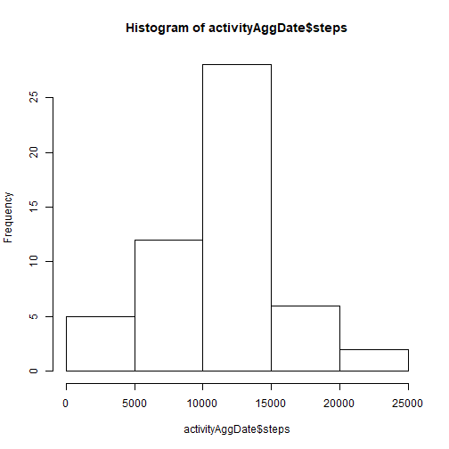
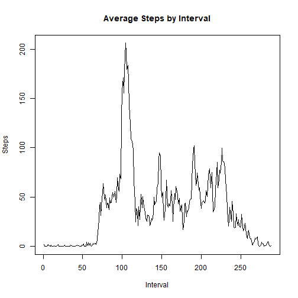
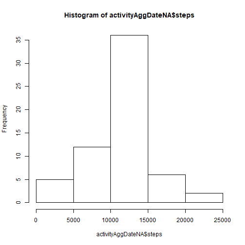
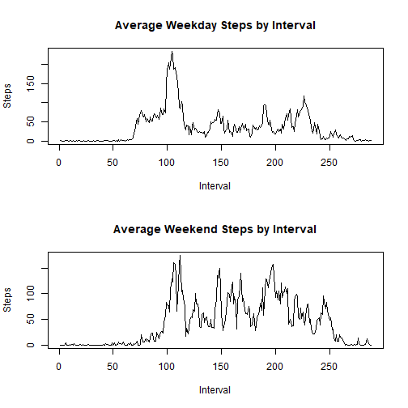

Clear variables

```r
rm(list = ls())
```

Download and unzip files

```r
urll<-"https://d396qusza40orc.cloudfront.net/repdata%2Fdata%2Factivity.zip"
destfile<-paste0(getwd(),"/","dataweek2.zip")
download.file(urll,destfile)
unzip("dataweek2.zip",exdir = getwd(), list = FALSE, overwrite = TRUE)
path<-"./"
```

Read the activities

```r
activity<-read.csv(paste0(path, "activity.csv"), header=TRUE)
activity$interval<-as.factor(activity$interval)
str(activity)
```

```
## 'data.frame':	17568 obs. of  3 variables:
##  $ steps   : int  NA NA NA NA NA NA NA NA NA NA ...
##  $ date    : Factor w/ 61 levels "2012-10-01","2012-10-02",..: 1 1 1 1 1 1 1 1 1 1 ...
##  $ interval: Factor w/ 288 levels "0","5","10","15",..: 1 2 3 4 5 6 7 8 9 10 ...
```

Histogram, median and mean of total daily steps

```r
activityAggDate<-aggregate(. ~ date, data = activity, FUN=sum, na.rm=TRUE)
hist(activityAggDate$steps)
```



```r
median(activityAggDate$steps, na.rm=TRUE)
```

```
## [1] 10765
```

```r
mean(activityAggDate$steps, na.rm=TRUE)
```

```
## [1] 10766.19
```

Data by interval

```r
activityAggInt<-aggregate(. ~ interval, data = activity, FUN=mean, na.rm=TRUE)
plot(x=as.numeric(activityAggInt$interval), 
	y=activityAggInt$steps, 
	type="l",
	main="Average Steps by Interval", ylab="Steps", xlab="Interval")
```



```r
maxSteps<-max(activityAggInt$steps)
pos<-which(activityAggInt$steps==maxSteps)
activityAggInt$interval[pos]
```

```
## [1] 835
## 288 Levels: 0 5 10 15 20 25 30 35 40 45 50 55 100 105 110 115 120 125 ... 2355
```

Dealing with NAs

```r
sum(is.na(activity$steps))
```

```
## [1] 2304
```

```r
#Fill in NAs with average for each interval
activityNA<-activity
pos<-match(activityNA$interval[is.na(activityNA$steps)],activityAggInt$interval)
activityNA$steps[is.na(activityNA$steps)]<-activityAggInt$steps[pos]
sum(is.na(activityNA$steps))
```

```
## [1] 0
```

```r
activityAggDateNA<-aggregate(. ~ date, data = activityNA, FUN=sum, na.rm=TRUE)
hist(activityAggDateNA$steps)
```



```r
median(activityAggDateNA$steps, na.rm=TRUE)
```

```
## [1] 10766.19
```

```r
mean(activityAggDateNA$steps, na.rm=TRUE)
```

```
## [1] 10766.19
```

Add weekdays to the data

```r
weekday<-weekdays(as.Date(activity$date))
weekday[which(weekday=="Saturday")]<-"Weekend"
weekday[which(weekday=="Sunday")]<-"Weekend"
weekday[which(weekday!="Weekend")]<-"Weekday"
activity<-cbind(activity, weekday)
activity$weekday<-as.factor(activity$weekday)
#Average data by weekday type and interval
activityAggWD<-aggregate(. ~ interval + weekday, data = activity, FUN=mean, na.rm=TRUE)
par(mfrow=c(2,1))
plot(as.numeric(activityAggWD$interval[activityAggWD$weekday=="Weekday"]), 
	activityAggWD$steps[activityAggWD$weekday=="Weekday"],
	type="l",
	main="Average Weekday Steps by Interval", ylab="Steps", xlab="Interval")
plot(as.numeric(activityAggWD$interval[activityAggWD$weekday=="Weekend"]), 
	activityAggWD$steps[activityAggWD$weekday=="Weekend"],
	type="l",
	main="Average Weekend Steps by Interval", ylab="Steps", xlab="Interval")
```




